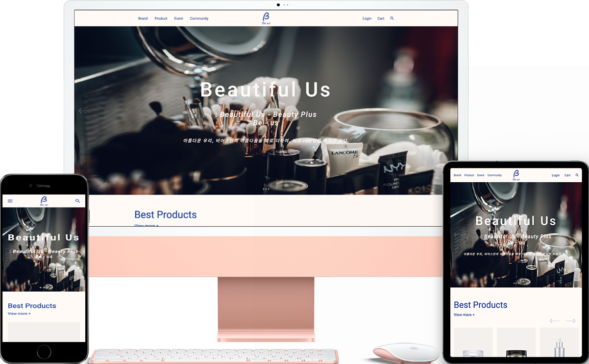

# First Project : Be-us
> Responsive Renewal Website
>> 100% 개인프로젝트 : 반응형 리뉴얼 웹사이트
- 소요기간 : 1개월 (디자인 + 코딩 포함)
- 사용기술 : HTML5, CSS3, Sass, Javascript
- 제작페이지 : 메인페이지, 로그인페이지

* * *
### 1. CONCEPT
**전체 분위기와 컨셉 자체는 기존 웹페이지와 비슷하게 진행하였습니다. 기존 메인페이지에서 중복되거나 중요도가 떨어지는 영역을 제외하였고, 브랜드 소개 영역을 새롭게 디자인했습니다. 또한, 폰트를 변경해 가독성을 높여주는 등의 변화를 주었습니다.** 
### GRID
- Full Width : 1920px
- Grid Width : 1320px
- Column Width : 70px
- Gutter Width : 40px (양쪽 끝 사이드 20px)
- Number of Column : 12
###
###

* * *
### 2. COLOR & FONT
### COLOR
**bg color, sub color를 사용하여 배경색을 영역별로 교차하여 배치했고, 배경색상과 조화를 이룰 수 있는 푸른 계열의 point color 색상을 선택해 폰트와 포인트 컬러로 활용하였습니다.** 
> bg color : #fbf4ef (R:251, G:244, B:239)

> point color : #1f4095 (R:31, G:64, B:149)

> sub color : #fffaf6 (R:255, G:250, B:246)

###
### FONT
**영어 폰트로는 Roboto, 한글 폰트로는 Noto Sans KR을 사용하였습니다.** 

* * *
### 3. PAGE
**메인페이지와 로그인페이지를 제작하였습니다.** 

[사이트보기](https://suu01.github.io/index.html, Be-us)